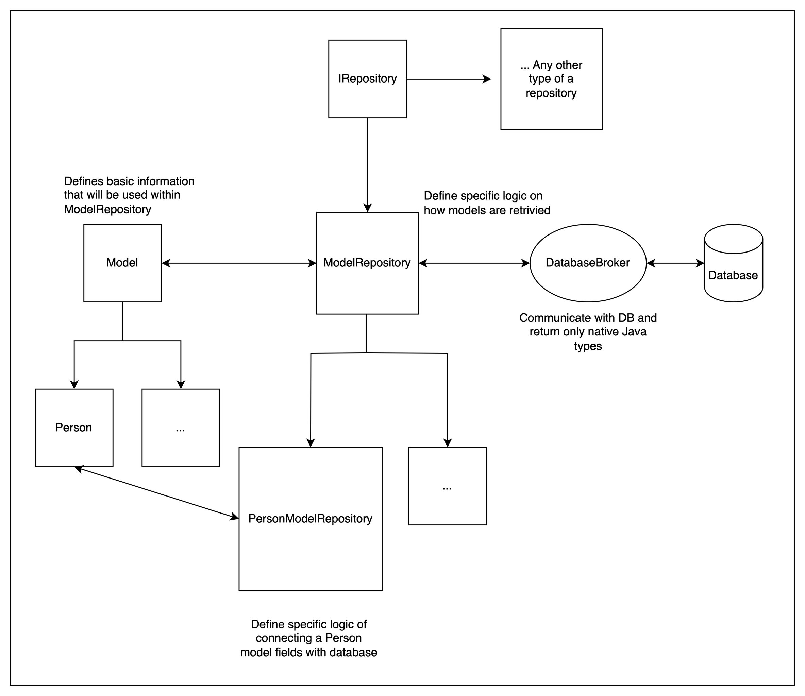

## Database communication
Communication with the databse goes through `DatabaseBroker`. This broker will perform queries and will be able to return their results. It uses only native Java types, so it is not coupled to any concrete implementation.

## Models
`Model` abstraction defines certain defaults and requires implementation from extended classes. Idea is to connect concrete class with a database table.

By default, ID column is set as a primary key. `Model` also requires a `ModelRepository` to be defined, since some of the default `Model` functions interact with a repository.

## Repositories
`IRepository` - This interface should describe any repository. In this example, only `ModelRepository` is implemented, but any other repository which fetches data from any other source can implement this interface too.

`ModelRepository` - Concrete implementation of `IRepository` which is coupled to abstract `Model` and knows how to utilise `Model` methods in order to enable CRUD operations against any given model. This is an abstract class.

`PersonModelRepository` - A repository specifically created for a `Person` model. These concrete classes should define how each of the database fields connects to a `Person` class.

## Additional
`ModelAttributeValue` - An interface which prompts `Object get()` and `set(Object)` methods to be implemented. It is used in concrete model repositories to enable get/set between repository and a model.